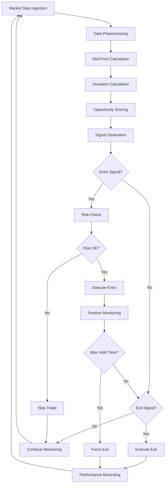

# AMIA Implementation Guide

## Table of Contents
1. [Implementation Workflow](#implementation-workflow)
2. [Code Architecture](#code-architecture)
3. [Data Requirements](#data-requirements)
4. [Step-by-Step Implementation](#step-by-step-implementation)
5. [Parameter Optimization](#parameter-optimization)
6. [Integration with Existing Systems](#integration-with-existing-systems)

## Implementation Workflow



## Code Architecture

### Core Components Structure

```
AMIA_Strategy/
├── data/
│   ├── market_data_handler.py      # Real-time data ingestion
│   ├── preprocessor.py             # Data cleaning and validation
│   └── symbol_manager.py           # Symbol mapping and validation
├── signals/
│   ├── deviation_calculator.py     # Mid-price deviation calculations
│   ├── opportunity_scorer.py       # Aggregated scoring logic
│   └── signal_generator.py         # Entry/exit signal generation
├── execution/
│   ├── position_manager.py         # Position tracking and management
│   ├── order_executor.py           # Trade execution logic
│   └── slippage_estimator.py       # Execution cost estimation
├── risk/
│   ├── risk_manager.py             # Real-time risk monitoring
│   ├── position_sizer.py           # Position sizing logic
│   └── stop_loss_manager.py        # Stop-loss implementation
├── performance/
│   ├── metrics_calculator.py       # Performance metrics
│   ├── trade_analyzer.py           # Trade-level analysis
│   └── backtester.py               # Historical backtesting
└── config/
    ├── strategy_config.py          # Strategy parameters
    └── exchange_config.py          # Exchange-specific settings
```

## Data Requirements

### 1. Real-Time Market Data

**Required Fields per Exchange**:
- `timestamp`: UTC timestamp with microsecond precision
- `symbol`: Standardized symbol notation
- `bid_price`: Best bid price
- `ask_price`: Best ask price  
- `bid_quantity`: Bid size
- `ask_quantity`: Ask size

**Data Frequency**: Minimum 100ms updates, optimal <50ms

**Data Quality Requirements**:
- Maximum 5% missing data points per hour
- Timestamp synchronization within 10ms across exchanges
- Price validation (no negative prices, reasonable bid-ask spreads)

### 2. Historical Data for Backtesting

**Required History**: Minimum 30 days, optimal 90+ days
**Storage Format**: Parquet or HDF5 for efficient retrieval
**Indexing**: Multi-index on (timestamp, exchange, symbol)

## Step-by-Step Implementation

### Step 1: Data Preprocessing Module

```python
# data/preprocessor.py
import pandas as pd
import numpy as np
from typing import Dict, Tuple

class AMIADataPreprocessor:
    def __init__(self, max_spread_pct: float = 0.05, outlier_threshold: float = 3.0):
        self.max_spread_pct = max_spread_pct
        self.outlier_threshold = outlier_threshold
    
    def preprocess_market_data(self, raw_data: pd.DataFrame) -> pd.DataFrame:
        """
        Preprocess raw market data for AMIA strategy
        
        Args:
            raw_data: DataFrame with columns [timestamp, exchange, symbol, bid_price, ask_price, bid_qty, ask_qty]
        
        Returns:
            Cleaned and validated DataFrame
        """
        df = raw_data.copy()
        
        # 1. Basic validation
        df = self._validate_prices(df)
        
        # 2. Calculate spreads and filter outliers
        df = self._calculate_spreads(df)
        df = self._filter_spread_outliers(df)
        
        # 3. Handle missing data
        df = self._handle_missing_data(df)
        
        # 4. Synchronize timestamps
        df = self._synchronize_timestamps(df)
        
        return df
    
    def _validate_prices(self, df: pd.DataFrame) -> pd.DataFrame:
        """Validate price data quality"""
        # Remove negative prices
        df = df[(df['bid_price'] > 0) & (df['ask_price'] > 0)]
        
        # Ensure bid <= ask
        df = df[df['bid_price'] <= df['ask_price']]
        
        # Remove zero quantities
        df = df[(df['bid_qty'] > 0) & (df['ask_qty'] > 0)]
        
        return df
    
    def _calculate_spreads(self, df: pd.DataFrame) -> pd.DataFrame:
        """Calculate bid-ask spreads"""
        df['mid_price'] = (df['bid_price'] + df['ask_price']) / 2
        df['spread'] = df['ask_price'] - df['bid_price']
        df['spread_pct'] = df['spread'] / df['mid_price']
        return df
    
    def _filter_spread_outliers(self, df: pd.DataFrame) -> pd.DataFrame:
        """Filter unrealistic spreads"""
        # Remove spreads wider than max_spread_pct
        df = df[df['spread_pct'] <= self.max_spread_pct]
        
        # Remove statistical outliers
        spread_z_score = np.abs((df['spread_pct'] - df['spread_pct'].mean()) / df['spread_pct'].std())
        df = df[spread_z_score <= self.outlier_threshold]
        
        return df
```

### Step 2: Deviation Calculator

```python
# signals_v2/deviation_calculator.py
import pandas as pd
import numpy as np
from typing import Dict

class DeviationCalculator:
    def __init__(self):
        pass
    
    def calculate_mid_price_deviations(self, df: pd.DataFrame) -> pd.DataFrame:
        """
        Calculate mid-price deviations for AMIA strategy
        
        Args:
            df: DataFrame with market data
            
        Returns:
            DataFrame with deviation calculations added
        """
        result_df = df.copy()
        
        # Calculate mid-price deviations
        result_df['bid_deviation'] = (result_df['bid_price'] - result_df['mid_price']) / result_df['mid_price']
        result_df['ask_deviation'] = (result_df['ask_price'] - result_df['mid_price']) / result_df['mid_price']
        
        # Validate calculations (should always be negative for ask, positive for bid in normal markets)
        result_df['bid_deviation'] = np.clip(result_df['bid_deviation'], -0.1, 0)  # Bid should be <= mid
        result_df['ask_deviation'] = np.clip(result_df['ask_deviation'], 0, 0.1)   # Ask should be >= mid
        
        return result_df
    
    def calculate_cross_exchange_deviations(self, spot_df: pd.DataFrame, futures_df: pd.DataFrame) -> pd.DataFrame:
        """
        Calculate deviations across spot and futures exchanges
        
        Args:
            spot_df: Spot exchange data with deviations
            futures_df: Futures exchange data with deviations
            
        Returns:
            Combined DataFrame with cross-exchange calculations
        """
        # Merge on timestamp for synchronized comparison
        merged = pd.merge_asof(
            spot_df.sort_values('timestamp'),
            futures_df.sort_values('timestamp'),
            on='timestamp',
            suffixes=('_spot', '_futures'),
            tolerance=pd.Timedelta('1s')  # Maximum 1 second time difference
        )
        
        # Calculate aggregated opportunities
        merged['entry_opportunity'] = merged['ask_deviation_spot'] + merged['bid_deviation_futures']
        merged['exit_opportunity'] = merged['bid_deviation_spot'] + merged['ask_deviation_futures']
        
        return merged
```

### Step 3: Signal Generator

```python
# signals_v2/signal_generator.py
import pandas as pd
import numpy as np
from typing import Tuple

class AMIASignalGenerator:
    def __init__(self, 
                 entry_threshold: float = -0.001,
                 exit_threshold: float = -0.0005,
                 min_individual_deviation: float = -0.0002,
                 max_hold_hours: float = 6):
        self.entry_threshold = entry_threshold
        self.exit_threshold = exit_threshold
        self.min_individual_deviation = min_individual_deviation
        self.max_hold_hours = max_hold_hours
    
    def generate_signals(self, df: pd.DataFrame) -> Tuple[pd.Series, pd.Series]:
        """
        Generate AMIA entry and exit signals_v2
        
        Args:
            df: DataFrame with opportunity calculations
            
        Returns:
            Tuple of (entry_signals, exit_signals)
        """
        # Entry conditions: Aggregated opportunity + individual leg validation
        entry_conditions = [
            df['entry_opportunity'] < self.entry_threshold,
            df['ask_deviation_spot'] < self.min_individual_deviation,
            df['bid_deviation_futures'] < self.min_individual_deviation
        ]
        entry_signals = np.all(entry_conditions, axis=0)
        
        # Exit conditions: Aggregated opportunity + individual leg validation
        exit_conditions = [
            df['exit_opportunity'] < self.exit_threshold,
            df['bid_deviation_spot'] < self.min_individual_deviation,
            df['ask_deviation_futures'] < self.min_individual_deviation
        ]
        exit_signals = np.all(exit_conditions, axis=0)
        
        return pd.Series(entry_signals, index=df.index), pd.Series(exit_signals, index=df.index)
    
    def apply_timing_filters(self, entry_signals: pd.Series, exit_signals: pd.Series, 
                           df: pd.DataFrame) -> Tuple[pd.Series, pd.Series]:
        """
        Apply timing-based filters to signals_v2
        """
        # Prevent rapid signal oscillation (minimum 30 seconds between signals_v2)
        min_signal_gap = pd.Timedelta('30s')
        
        filtered_entry = entry_signals.copy()
        filtered_exit = exit_signals.copy()
        
        last_signal_time = None
        for idx, timestamp in enumerate(df['timestamp']):
            if last_signal_time and (timestamp - last_signal_time) < min_signal_gap:
                filtered_entry.iloc[idx] = False
                filtered_exit.iloc[idx] = False
            elif filtered_entry.iloc[idx] or filtered_exit.iloc[idx]:
                last_signal_time = timestamp
        
        return filtered_entry, filtered_exit
```

### Step 4: Position Manager

```python
# execution/position_manager.py
import pandas as pd
from typing import Optional, Dict, List
from dataclasses import dataclass
from enum import Enum

class PositionStatus(Enum):
    OPEN = "open"
    CLOSED = "closed"
    FORCE_CLOSED = "force_closed"

@dataclass
class Position:
    entry_time: pd.Timestamp
    spot_entry_price: float
    futures_entry_price: float
    position_size: float
    status: PositionStatus = PositionStatus.OPEN
    exit_time: Optional[pd.Timestamp] = None
    spot_exit_price: Optional[float] = None
    futures_exit_price: Optional[float] = None
    pnl: Optional[float] = None

class AMIAPositionManager:
    def __init__(self, max_hold_hours: float = 6, max_positions: int = 1):
        self.max_hold_hours = max_hold_hours
        self.max_positions = max_positions
        self.active_positions: List[Position] = []
        self.closed_positions: List[Position] = []
    
    def can_open_position(self) -> bool:
        """Check if new position can be opened"""
        return len(self.active_positions) < self.max_positions
    
    def open_position(self, timestamp: pd.Timestamp, spot_price: float, 
                     futures_price: float, position_size: float) -> Position:
        """Open new AMIA position"""
        if not self.can_open_position():
            raise ValueError("Maximum positions limit reached")
        
        position = Position(
            entry_time=timestamp,
            spot_entry_price=spot_price,
            futures_entry_price=futures_price,
            position_size=position_size
        )
        
        self.active_positions.append(position)
        return position
    
    def close_position(self, position: Position, timestamp: pd.Timestamp,
                      spot_price: float, futures_price: float, 
                      force_close: bool = False) -> float:
        """Close existing position and calculate P&L"""
        # Calculate P&L
        spot_pnl = (spot_price - position.spot_entry_price) * position.position_size
        futures_pnl = (position.futures_entry_price - futures_price) * position.position_size
        total_pnl = spot_pnl + futures_pnl
        
        # Update position
        position.exit_time = timestamp
        position.spot_exit_price = spot_price
        position.futures_exit_price = futures_price
        position.pnl = total_pnl
        position.status = PositionStatus.FORCE_CLOSED if force_close else PositionStatus.CLOSED
        
        # Move to closed positions
        self.active_positions.remove(position)
        self.closed_positions.append(position)
        
        return total_pnl
    
    def check_force_close(self, current_time: pd.Timestamp) -> List[Position]:
        """Check for positions that need force closing due to max hold time"""
        positions_to_close = []
        for position in self.active_positions:
            hold_time_hours = (current_time - position.entry_time).total_seconds() / 3600
            if hold_time_hours >= self.max_hold_hours:
                positions_to_close.append(position)
        return positions_to_close
```

## Parameter Optimization

### 1. Grid Search Optimization

```python
# performance/parameter_optimizer.py
import pandas as pd
import numpy as np
from itertools import product
from typing import Dict, List, Tuple

class AMIAParameterOptimizer:
    def __init__(self, backtest_data: pd.DataFrame):
        self.backtest_data = backtest_data
        
    def grid_search_optimization(self) -> Dict:
        """
        Perform grid search for optimal AMIA parameters
        """
        # Parameter ranges for optimization
        entry_thresholds = [-0.002, -0.0015, -0.001, -0.0008, -0.0005]
        exit_thresholds = [-0.001, -0.0008, -0.0005, -0.0003, -0.0001]
        min_deviations = [-0.0005, -0.0003, -0.0002, -0.0001, -0.00005]
        
        best_params = None
        best_sharpe = -np.inf
        results = []
        
        for entry_thresh, exit_thresh, min_dev in product(
            entry_thresholds, exit_thresholds, min_deviations
        ):
            # Ensure logical parameter ordering
            if entry_thresh >= exit_thresh or min_dev >= entry_thresh/2:
                continue
                
            # Run backtest with current parameters
            backtest_result = self._run_backtest(entry_thresh, exit_thresh, min_dev)
            
            if backtest_result['sharpe_ratio'] > best_sharpe:
                best_sharpe = backtest_result['sharpe_ratio']
                best_params = {
                    'entry_threshold': entry_thresh,
                    'exit_threshold': exit_thresh,
                    'min_individual_deviation': min_dev
                }
            
            results.append({
                'entry_threshold': entry_thresh,
                'exit_threshold': exit_thresh,
                'min_individual_deviation': min_dev,
                **backtest_result
            })
        
        return {
            'best_parameters': best_params,
            'best_sharpe_ratio': best_sharpe,
            'all_results': pd.DataFrame(results)
        }
    
    def _run_backtest(self, entry_thresh: float, exit_thresh: float, 
                     min_dev: float) -> Dict:
        """Run backtest with given parameters"""
        # Implementation would use the backtesting framework
        # This is a simplified version
        pass
```

### 2. Walk-Forward Analysis

```python
def walk_forward_analysis(self, window_size_days: int = 30, 
                         step_size_days: int = 7) -> pd.DataFrame:
    """
    Perform walk-forward analysis for parameter stability
    """
    results = []
    data_start = self.backtest_data.index.min()
    data_end = self.backtest_data.index.max()
    
    current_start = data_start
    while current_start + pd.Timedelta(days=window_size_days) < data_end:
        train_end = current_start + pd.Timedelta(days=window_size_days)
        test_start = train_end
        test_end = test_start + pd.Timedelta(days=step_size_days)
        
        if test_end > data_end:
            break
        
        # Training period optimization
        train_data = self.backtest_data[current_start:train_end]
        optimizer = AMIAParameterOptimizer(train_data)
        best_params = optimizer.grid_search_optimization()['best_parameters']
        
        # Test period validation
        test_data = self.backtest_data[test_start:test_end]
        test_results = self._run_backtest_with_params(test_data, best_params)
        
        results.append({
            'train_start': current_start,
            'train_end': train_end,
            'test_start': test_start,
            'test_end': test_end,
            'test_sharpe': test_results['sharpe_ratio'],
            'test_total_return': test_results['total_return'],
            **best_params
        })
        
        current_start += pd.Timedelta(days=step_size_days)
    
    return pd.DataFrame(results)
```

## Integration with Existing Systems

### 1. Integration with CEX Arbitrage Engine

```python
# integration/cex_arbitrage_integration.py
from exchanges.exchange_factory import get_composite_implementation
from config.config_manager import HftConfig

class AMIACEXIntegration:
    def __init__(self):
        self.config_manager = HftConfig()
        self.spot_exchange = None
        self.futures_exchange = None
        self.amia_strategy = None
    
    async def initialize_exchanges(self):
        """Initialize exchange connections for AMIA strategy"""
        # Get exchange configurations
        mexc_config = self.config_manager.get_exchange_config('mexc')
        gateio_futures_config = self.config_manager.get_exchange_config('gateio_futures')
        
        # Initialize exchange instances
        self.spot_exchange = get_composite_implementation(mexc_config, is_private=False)
        self.futures_exchange = get_composite_implementation(gateio_futures_config, is_private=False)
        
        # Initialize both exchanges
        symbols = [Symbol(base=AssetName("BTC"), quote=AssetName("USDT"))]
        await self.spot_exchange.init(symbols)
        await self.futures_exchange.init(symbols)
    
    async def run_amia_strategy(self):
        """Main AMIA strategy execution loop"""
        while True:
            try:
                # Get real-time data from both exchanges
                spot_data = await self._get_spot_market_data()
                futures_data = await self._get_futures_market_data()
                
                # Run AMIA signal generation
                signals = self.amia_strategy.generate_signals(spot_data, futures_data)
                
                # Execute trades if signals_v2 are triggered
                if signals['entry_signal']:
                    await self._execute_entry_trade()
                elif signals['exit_signal']:
                    await self._execute_exit_trade()
                
                # Risk management checks
                await self._perform_risk_checks()
                
                await asyncio.sleep(0.1)  # 100ms update frequency
                
            except Exception as e:
                logger.error(f"AMIA strategy error: {e}")
                await asyncio.sleep(1)
```

### 2. Database Integration

```python
# integration/database_integration.py
from db.operations import insert_trade_record, get_market_data

class AMIADatabaseIntegration:
    def __init__(self, db_manager):
        self.db_manager = db_manager
    
    async def store_amia_trade(self, trade_record: Dict):
        """Store AMIA trade in database"""
        await insert_trade_record(
            strategy_name="AMIA",
            trade_data=trade_record,
            db_manager=self.db_manager
        )
    
    async def load_historical_data(self, symbol: str, start_date: str, 
                                  end_date: str) -> pd.DataFrame:
        """Load historical data for AMIA backtesting"""
        return await get_market_data(
            symbol=symbol,
            start_date=start_date,
            end_date=end_date,
            db_manager=self.db_manager
        )
```

---

**Next**: See [Risk Management Framework](AMIA_risk_management.md) for comprehensive risk controls and [Example Implementation](AMIA_example_implementation.py) for complete working code.