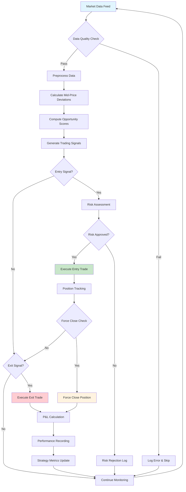
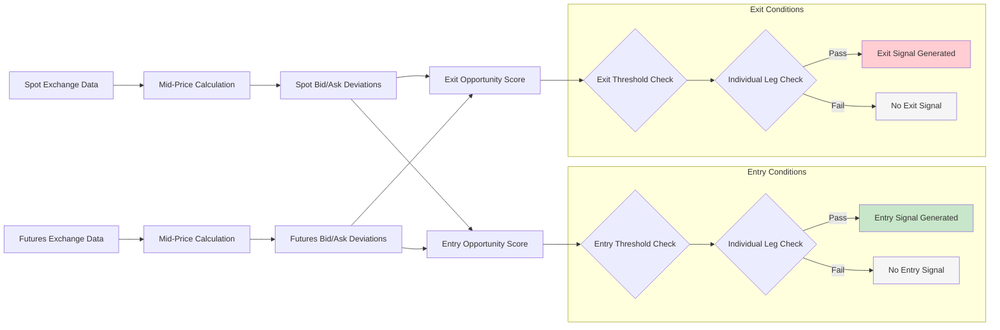
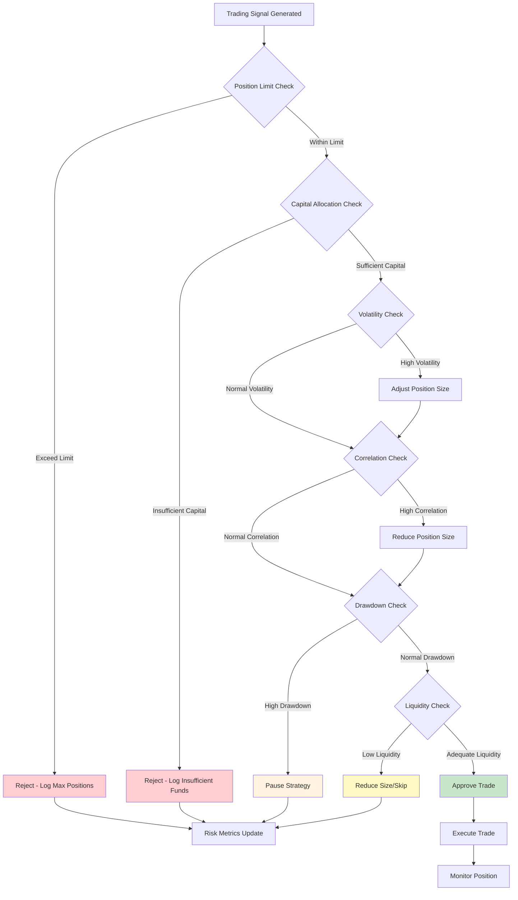
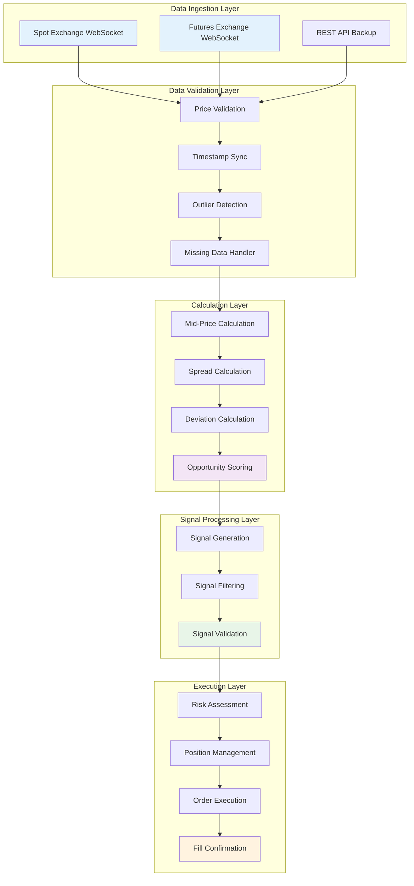
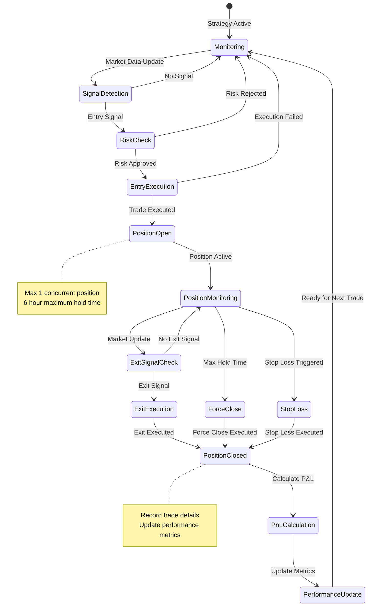
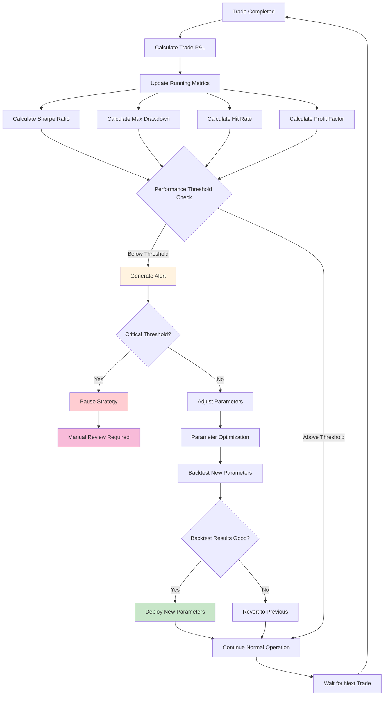
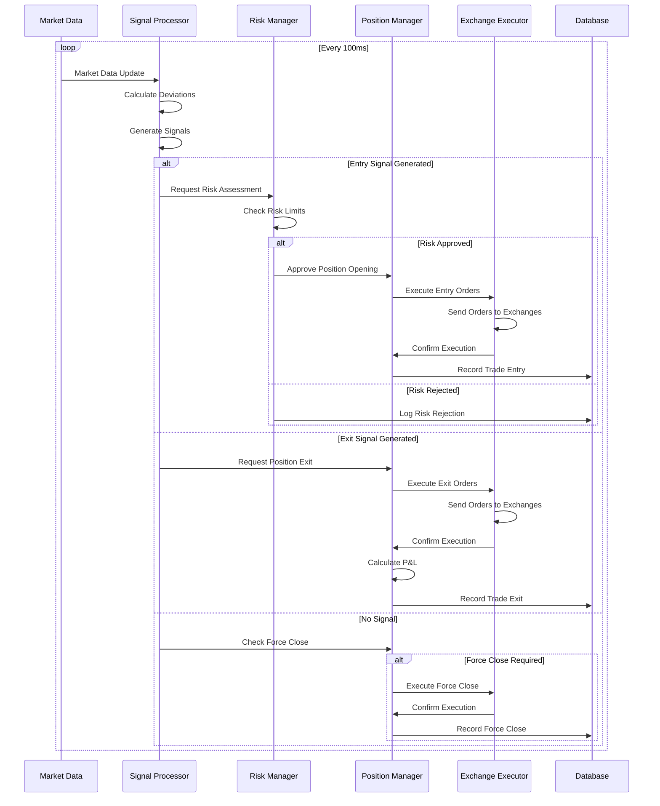
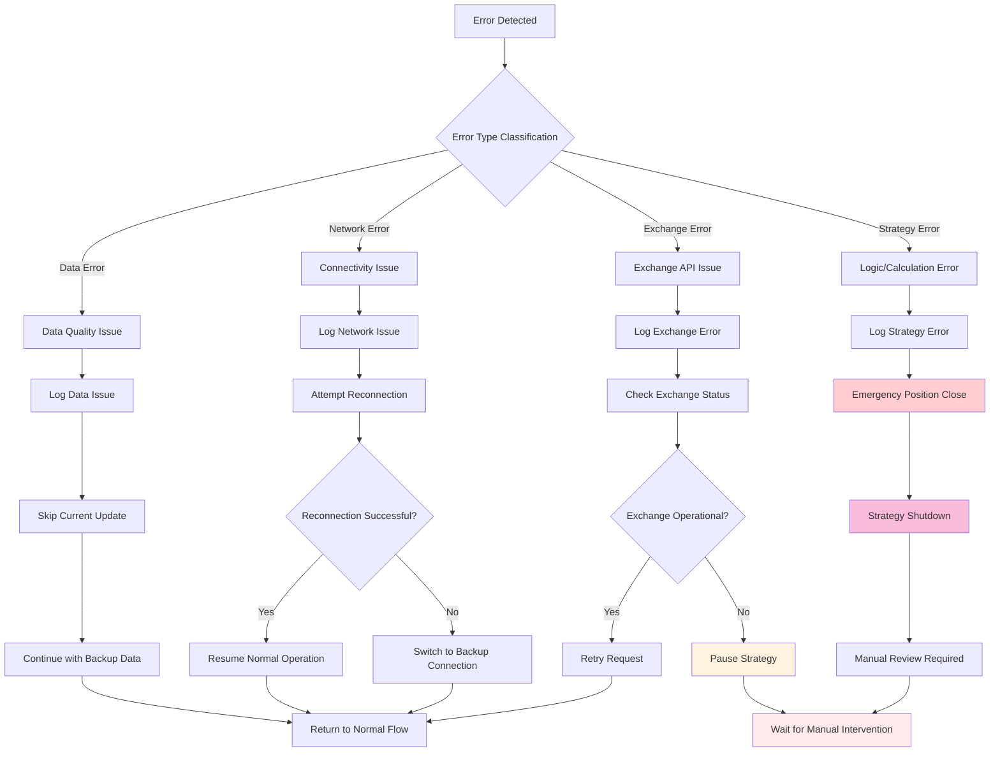
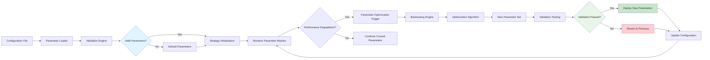

# AMIA Strategy Workflow Diagrams

## Table of Contents
1. [High-Level Strategy Flow](#high-level-strategy-flow)
2. [Signal Generation Workflow](#signal-generation-workflow)
3. [Risk Management Decision Tree](#risk-management-decision-tree)
4. [Data Processing Pipeline](#data-processing-pipeline)
5. [Position Lifecycle Management](#position-lifecycle-management)
6. [Performance Monitoring Workflow](#performance-monitoring-workflow)

## High-Level Strategy Flow

## Signal Generation Workflow

## Risk Management Decision Tree

## Data Processing Pipeline

## Position Lifecycle Management

## Performance Monitoring Workflow

## Real-Time Decision Flow

## Error Handling and Recovery Workflow

## Configuration and Parameter Management

---

These workflow diagrams provide comprehensive visual representations of the AMIA strategy's operational flow, decision-making processes, and system interactions. They serve as both implementation guides and operational references for understanding the strategy's behavior in various scenarios.

**Next**: See [Risk Management Framework](AMIA_risk_management.md) for detailed risk controls and [Example Implementation](AMIA_example_implementation.py) for complete working code.