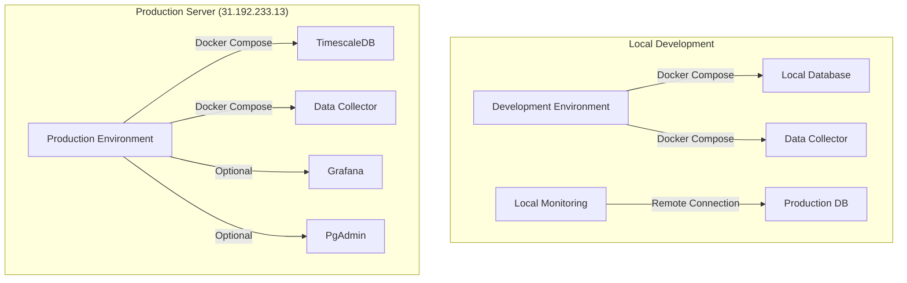

# CEX Arbitrage Infrastructure Documentation

## 🏗️ High-Frequency Trading Infrastructure

This directory contains the complete Docker-based infrastructure for the CEX Arbitrage high-frequency trading system, designed for sub-50ms execution targets and 99.9%+ uptime.

## 📋 Table of Contents

- [Quick Start](#-quick-start)
- [Architecture Overview](#-architecture-overview)
- [Environment Management](#-environment-management)
- [Development Workflow](#-development-workflow)
- [Production Deployment](#-production-deployment)
- [Monitoring & Observability](#-monitoring--observability)
- [Maintenance & Operations](#-maintenance--operations)
- [Troubleshooting](#-troubleshooting)
- [Advanced Configuration](#-advanced-configuration)

## 🚀 Quick Start

### Prerequisites

- Docker Engine 20.10+ and Docker Compose V2
- SSH access to production server (31.192.233.13)
- Make utility for running commands

### 30-Second Setup

```bash
# 1. Setup environment files
make setup-env

# 2. Start local development environment
make dev

# 3. Access services
# Grafana: http://localhost:3000 (admin/dev_grafana)
# PgAdmin: http://localhost:8080 (admin@example.com/dev_admin)
```

### Production Deployment

```bash
# 1. Configure production credentials
vim .env.prod

# 2. Deploy to server
make deploy

# 3. Monitor deployment
make status
```

## 🏛️ Architecture Overview

### System Components



### Infrastructure Stack

| Component | Technology | Purpose | Environment |
|-----------|------------|---------|-------------|
| **Database** | TimescaleDB (PostgreSQL 15) | High-performance time-series data storage | All |
| **Data Collector** | Python FastAPI + asyncio | Real-time market data collection and arbitrage detection | All |
| **Monitoring** | Grafana + Prometheus | Real-time system monitoring and alerting | All |
| **Administration** | PgAdmin 4 | Database management and query interface | All |
| **Load Balancer** | Nginx | Request routing and SSL termination | Production |

### Performance Specifications

- **Latency Target**: <50ms end-to-end arbitrage execution
- **Throughput**: 1000+ market updates/second processing
- **Availability**: 99.9%+ uptime with automated recovery
- **Data Retention**: 24-48 hours for high-frequency data
- **Backup Strategy**: Daily automated backups with 7-day retention

## 🔧 Environment Management

### Environment Files

The system uses environment-specific configuration files:

#### `.env.local` (Development)
```bash
GRAFANA_PASSWORD=local_grafana_2024
PGADMIN_EMAIL=admin@localhost.com
PGADMIN_PASSWORD=local_pgadmin_2024
DB_PASSWORD=dev_password_2024
```

#### `.env.prod` (Production)
```bash
# Production Environment Configuration
GRAFANA_PASSWORD=SECURE_PRODUCTION_PASSWORD
PGADMIN_EMAIL=admin@31.192.233.13
PGADMIN_PASSWORD=SECURE_PRODUCTION_PASSWORD
DB_PASSWORD=SECURE_PRODUCTION_PASSWORD
SLACK_WEBHOOK_URL=https://hooks.slack.com/your/webhook/url
```

### Docker Compose Configurations

| File | Purpose | Usage |
|------|---------|-------|
| `docker-compose.yml` | Base configuration with core services | All environments |
| `docker-compose.dev.yml` | Development overrides and debugging tools | Local development |
| `docker-compose.prod.yml` | Production optimizations and security | Production deployment |
| `docker-compose.local-monitoring.yml` | Local monitoring connecting to remote DB | Local monitoring |

### Available Commands

```bash
# Environment Setup
make setup-env              # Setup all environment files
make validate-config        # Validate Docker Compose configurations
make install                # Complete installation and setup

# Development
make dev                    # Start complete development environment
make dev-rebuild            # Rebuild and restart development
make stop-dev               # Stop all development services

# Production Deployment
make deploy                 # Full production deployment
make deploy-quick           # Quick deployment (code + restart)
make sync-code              # Sync code to production server

# Monitoring
make monitor                # Start local monitoring stack
make prod-monitoring        # Start production Grafana
make prod-admin             # Start production PgAdmin

# Maintenance
make maintain-server        # Run comprehensive server maintenance
make clean                  # Clean local Docker resources
make backup-db              # Create database backup

# Debugging
make status                 # Show current system status
make logs                   # Show data collector logs
make debug                  # Show comprehensive diagnostic info
```

## 💻 Development Workflow

### Local Development Setup

1. **Initialize Environment**
   ```bash
   make setup-env
   ```

2. **Start Development Environment**
   ```bash
   make dev
   ```

3. **Access Services**
   - **Grafana**: http://localhost:3000 (admin/dev_grafana)
   - **PgAdmin**: http://localhost:8080 (admin@example.com/dev_admin)
   - **Database**: localhost:5432 (arbitrage_user/dev_password_2024)

4. **Development Cycle**
   ```bash
   # Make code changes
   vim ../src/application.py
   
   # Rebuild and test
   make dev-rebuild
   
   # Check logs
   make logs
   
   # Clean up when done
   make stop-dev
   ```

### Local Monitoring of Production

Monitor production database from local Grafana/PgAdmin:

```bash
# Start local monitoring connecting to production DB
make monitor

# Access local Grafana with production data
open http://localhost:3000
```

## 🚀 Production Deployment

### Initial Production Setup

1. **Configure Production Environment**
   ```bash
   # Edit production credentials
   vim .env.prod
   
   # Set secure passwords for:
   # - DB_PASSWORD
   # - GRAFANA_PASSWORD  
   # - PGADMIN_PASSWORD
   # - SLACK_WEBHOOK_URL (for alerts)
   ```

2. **Deploy to Production Server**
   ```bash
   make deploy
   ```

3. **Verify Deployment**
   ```bash
   make status
   ```

### Production Server Configuration

**Server**: 31.192.233.13  
**SSH Access**: `ssh -i ~/.ssh/deploy_ci root@31.192.233.13`  
**Remote Path**: `/opt/arbitrage`

### Deployment Process

The deployment process includes:

1. **Code Synchronization**: rsync with exclusions for sensitive files
2. **Docker Installation**: Automatic Docker installation if needed
3. **Environment Setup**: Production environment file creation
4. **Service Deployment**: Core services (database + data collector)
5. **Health Verification**: Container health checks

### Production Services

```bash
# Core Services (Always Running)
make deploy                  # Database + Data Collector

# Optional Services (On Demand)
make prod-monitoring         # Grafana monitoring
make prod-admin             # PgAdmin administration
```

## 📊 Monitoring & Observability

### Grafana Dashboards

**Local Access**: http://localhost:3000  
**Production Access**: http://31.192.233.13:3000 (when enabled)

**Available Dashboards**:
- **HFT Trading Metrics**: Real-time arbitrage opportunities and execution metrics
- **System Performance**: Container resources, database performance, API latencies
- **Market Data Quality**: Data freshness, WebSocket stability, exchange connectivity

**Key Metrics**:
- Arbitrage execution latency (<50ms target)
- Market data processing rate (1000+ updates/sec)
- Database query performance (<5ms for critical queries)
- System uptime and availability

### Database Administration

**Local PgAdmin**: http://localhost:8080  
**Production PgAdmin**: http://31.192.233.13:8080 (when enabled)

**Connection Details**:
- **Host**: arbitrage_db (container) or 31.192.233.13 (remote)
- **Port**: 5432
- **Database**: arbitrage_data
- **Username**: arbitrage_user

### Health Monitoring

```bash
# Check system status
make status

# View application logs
make logs

# Comprehensive diagnostics
make debug
```

### Automated Monitoring

Production includes automated monitoring with:
- **Disk space alerts**: 70% warning, 85% critical
- **Database size monitoring**: 10GB limit with auto-cleanup
- **Container health checks**: Auto-restart on failure
- **Slack notifications**: Real-time alerts to team

## 🔧 Maintenance & Operations

### Automated Maintenance

The system includes comprehensive automated maintenance:

```bash
# Run full server maintenance
make maintain-server
```

**Maintenance Tasks Include**:
- Disk space cleanup and optimization
- Database chunk retention (24-48h data retention)
- Docker resource cleanup
- Health monitoring and alerting
- Automated backup creation

### Manual Maintenance Operations

```bash
# Database Operations
make backup-db               # Create database backup
make clean-server           # Clean server Docker resources

# Local Operations  
make clean                  # Clean local Docker resources
make reset                  # DANGER: Reset all local data
```

### Database Maintenance

**TimescaleDB Retention Policies**:
- **Order Flow Metrics**: 24 hours
- **Book Ticker Snapshots**: 24 hours  
- **Trades**: 48 hours
- **Orderbook Depth**: 24 hours

**Automated Cleanup Schedule**:
- **Every 6 hours**: TimescaleDB chunk cleanup
- **Daily**: Docker system cleanup and log rotation
- **Weekly**: Database optimization and index maintenance

### Backup Strategy

**Automated Backups**:
- **Frequency**: Daily at 2 AM UTC
- **Retention**: 7 days
- **Location**: `/opt/arbitrage/backups/`
- **Format**: Compressed SQL dumps

**Manual Backup**:
```bash
make backup-db
```

## 🐛 Troubleshooting

### Common Issues

#### Development Environment

**Issue**: Containers fail to start
```bash
# Check Docker daemon
docker --version
systemctl status docker

# Validate configurations  
make validate-config

# Check resource usage
docker system df
```

**Issue**: Database connection errors
```bash
# Check database health
docker exec arbitrage_db pg_isready -U arbitrage_user

# Check container logs
make logs

# Reset environment if needed
make reset
```

#### Production Deployment

**Issue**: SSH connection failures
```bash
# Test SSH connection
ssh -i ~/.ssh/deploy_ci root@31.192.233.13 'echo "Connection OK"'

# Check SSH key permissions
chmod 600 ~/.ssh/deploy_ci
```

**Issue**: Deployment failures
```bash
# Check server status
make status

# Check server disk space
ssh -i ~/.ssh/deploy_ci root@31.192.233.13 'df -h'

# Run server maintenance
make maintain-server
```

#### Performance Issues

**Issue**: High latency or slow queries
```bash
# Check database performance
ssh -i ~/.ssh/deploy_ci root@31.192.233.13 'docker exec arbitrage_db pg_stat_activity'

# Run database optimization
ssh -i ~/.ssh/deploy_ci root@31.192.233.13 '/opt/arbitrage/devops_refactoring/scripts/03_database_optimization.sh'
```

### Diagnostic Commands

```bash
# System Status
make status                 # Overall system status
make debug                  # Comprehensive diagnostics
make logs                   # Application logs

# Server-Specific
ssh -i ~/.ssh/deploy_ci root@31.192.233.13 'df -h'                    # Disk usage
ssh -i ~/.ssh/deploy_ci root@31.192.233.13 'docker ps'                # Container status  
ssh -i ~/.ssh/deploy_ci root@31.192.233.13 '/opt/arbitrage/monitoring_dashboard.sh'  # Server dashboard
```

### Log Locations

**Local Development**:
- Docker logs: `docker-compose logs`
- Application logs: `logs/` directory

**Production Server**:
- Application logs: `/opt/arbitrage/logs/`
- System logs: `/var/log/`
- Monitoring logs: `/var/log/*_monitoring.log`

## ⚙️ Advanced Configuration

### Custom Docker Compose Overrides

Create custom overrides for specific needs:

```yaml
# docker-compose.override.yml
version: '3.8'
services:
  data_collector:
    environment:
      - DEBUG=true
      - LOG_LEVEL=debug
    volumes:
      - ./custom-config:/app/config
```

### Network Configuration

**Default Network**: `arbitrage_network`
- All services communicate within this network
- Database is accessible at `arbitrage_db:5432`
- Data collector accessible at `arbitrage_collector:8080`

### Volume Management

**Persistent Volumes**:
- `postgres_data`: Database storage
- `grafana_data`: Grafana dashboards and settings
- `pgadmin_data`: PgAdmin configuration

**Backup Volumes**:
```bash
# Backup volumes
docker run --rm -v postgres_data:/data -v $(pwd)/backup:/backup alpine tar czf /backup/postgres_backup.tar.gz -C /data .

# Restore volumes  
docker run --rm -v postgres_data:/data -v $(pwd)/backup:/backup alpine tar xzf /backup/postgres_backup.tar.gz -C /data
```

### Security Configuration

**Production Security Measures**:
- Environment variable encryption
- SSH key-based authentication
- Docker socket security
- Network isolation
- Resource limits and quotas

**Environment Security**:
```bash
# Encrypt production environment file
gpg --symmetric --cipher-algo AES256 .env.prod
```

### Performance Tuning

**Database Configuration**:
- TimescaleDB chunk sizing optimization
- Connection pooling configuration
- Memory and CPU allocation tuning
- Index optimization for trading queries

**Container Resources**:
```yaml
# Resource limits example
services:
  database:
    deploy:
      resources:
        limits:
          memory: 4G
          cpus: '2.0'
        reservations:
          memory: 2G
          cpus: '1.0'
```

## 📚 Additional Resources

### Documentation Files

- **DEPLOYMENT_GUIDE.md**: Detailed deployment procedures
- **README-prometheus.md**: Prometheus monitoring setup
- **Docker Compose Files**: Service-specific documentation

### Architecture Specifications

- **[HFT Requirements Compliance](../specs/performance/hft-requirements-compliance.md)**: Performance specifications
- **[Database Configuration](../specs/configuration/database-configuration-spec.md)**: Database setup details  
- **[Network Configuration](../specs/configuration/network-configuration-spec.md)**: Network architecture

### Emergency Procedures

- **[Emergency Response Scripts](../devops_refactoring/scripts/)**: Automated crisis response
- **[Prevention Policies](../devops_refactoring/docs/prevention_policies.md)**: Operational policies

---

## 🆘 Emergency Contacts

**Disk Space Crisis**: Use emergency scripts in `../devops_refactoring/scripts/`  
**System Outage**: Check automated monitoring and health scripts  
**Performance Issues**: Refer to HFT compliance documentation

**Infrastructure Team**: Review this documentation and emergency procedures before escalation.

---

*This infrastructure is designed for high-frequency trading operations. Any changes should be tested in development before production deployment.*