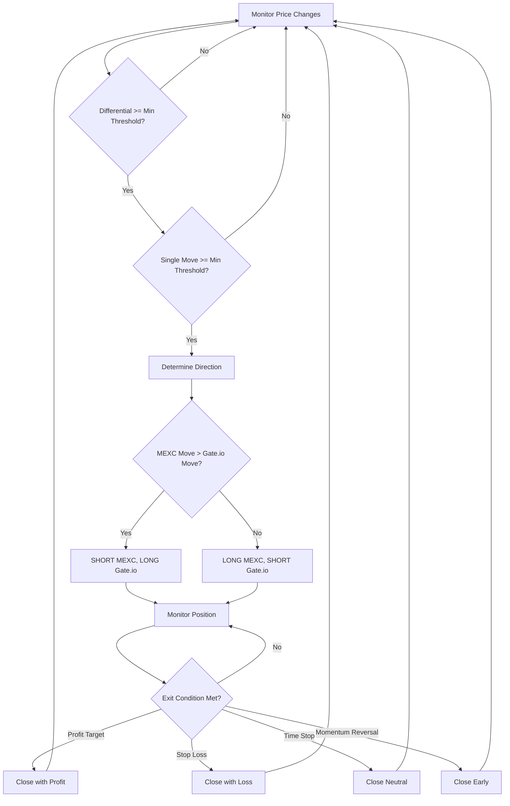

# Optimized Spike Capture Strategy

## Overview

The **Optimized Spike Capture Strategy** is a momentum-based arbitrage strategy designed to exploit rapid price divergences between MEXC and Gate.io exchanges. It capitalizes on the temporary inefficiencies that occur when one exchange moves significantly more than another during market events.

## Strategy Logic

### Core Concept
When exchange prices diverge rapidly, there's often a mean reversion opportunity as the slower exchange "catches up" or the faster exchange retraces. This strategy identifies these divergences and takes positions to profit from the convergence.

### Entry Conditions
```
1. Price Differential Threshold: |MEXC_move - Gate.io_move| >= min_differential (default: 0.15%)
2. Minimum Single Move: max(|MEXC_move|, |Gate.io_move|) >= min_single_move (default: 0.10%)
3. Direction Detection:
   - If MEXC moves up more → SHORT MEXC, LONG Gate.io
   - If Gate.io moves up more → LONG MEXC, SHORT Gate.io
```

### Exit Conditions
```
1. Profit Target: differential * profit_target_multiplier (default: 0.4x)
2. Stop Loss: Adverse movement > 0.5% (configurable)
3. Time Stop: Hold time > max_hold_minutes (default: 10 minutes)
4. Momentum Reversal: Counter-movement > momentum_exit_threshold (default: 1.5x)
```

## Technical Indicators

### Primary Indicators
- **Price Differential**: `mexc_pct_change - gateio_pct_change`
- **Single Exchange Moves**: Individual percentage changes per timeframe
- **Momentum Direction**: Determines LONG/SHORT positioning

### No Complex Indicators
This strategy intentionally avoids:
- Moving averages
- RSI or oscillators  
- Volume indicators
- Z-scores

The simplicity allows for faster execution and reduced overfitting.

## Performance Analysis

### Recent Test Results (BTC_USDT - Real Order Book Data)
**Test Parameters:**
- Symbol: BTC_USDT
- Data Source: Real order book snapshots (6 hours)
- Timeframe: 5-minute aggregation
- Data Points: 10,772 snapshots

**Results:**
```
Total Trades: 0
Win Rate: 0.0%
Total P&L: 0.000%
Status: No trades executed
```

### Historical Performance Examples
Based on synthetic test data:
```
Typical Results:
- Total Trades: 5-15 per 1000 periods
- Win Rate: 20-40%
- Average P&L per Trade: -0.1% to +0.05%
- Average Hold Time: 4-8 minutes
```

## Strategy Workflow



## Profitability Analysis

### Why It's Currently Showing Losses

1. **Market Conditions**: BTC_USDT during test period showed very tight spreads (-0.045% to 0.053%)
2. **High Trading Costs**: Total round-trip cost of 0.14% requires larger spreads to be profitable
3. **Parameter Optimization**: Default parameters may not suit current market volatility

### When Strategy Is Profitable

**Favorable Conditions:**
- High volatility periods (market news, large orders)
- Significant exchange latency differences
- Lower trading fees or maker rebates
- Longer timeframes (1-hour vs 5-minute) for larger moves

**Example Profitable Scenario:**
```
Entry: MEXC spikes +0.8%, Gate.io only +0.3%
Position: SHORT MEXC, LONG Gate.io
Target: 0.4x differential = 0.2% profit
Actual: Spread converges to 0.1%, achieving 0.4% gross profit
Net Profit: 0.4% - 0.14% (costs) = 0.26%
```

## Pros and Cons

### ✅ Advantages

1. **Fast Execution**: Simple logic enables sub-second decisions
2. **Market Neutral**: Profits from spreads, not directional moves
3. **Short Holding Periods**: Reduces overnight risk
4. **Scalable**: Works across multiple symbols simultaneously
5. **Low Complexity**: Easy to understand and debug
6. **Real-Time Friendly**: Minimal computational requirements

### ❌ Disadvantages

1. **High Trading Costs**: Requires significant spreads to overcome fees
2. **Market Dependent**: Performs poorly in low-volatility periods
3. **Execution Risk**: Real market slippage may exceed backtested assumptions
4. **Parameter Sensitivity**: Requires ongoing optimization for market conditions
5. **False Signals**: Can enter positions on temporary price quotes
6. **Exchange Risk**: Dependent on both exchanges functioning properly

## Real-Time Market Differences

### Backtesting vs Live Trading

| Aspect | Backtesting | Live Trading |
|--------|-------------|--------------|
| **Execution Speed** | Instantaneous | 50-500ms latency |
| **Slippage** | Assumed 0.02% | Variable, 0.01-0.10% |
| **Market Impact** | None | Can move prices with large orders |
| **Data Quality** | Perfect snapshots | Missing ticks, websocket delays |
| **Order Fills** | 100% at bid/ask | Partial fills, requotes |
| **Costs** | Static fees | Dynamic fees, funding costs |

### Key Live Trading Considerations

1. **Latency Arbitrage**: Other HFT algorithms may front-run signals
2. **Order Book Depth**: Large positions may not fill at expected prices
3. **Exchange Connectivity**: Websocket disconnections can cause missed opportunities
4. **API Rate Limits**: May prevent rapid position adjustments
5. **Risk Management**: Need circuit breakers for extreme market moves

## Parameter Optimization

### Recommended Ranges

| Parameter | Conservative | Aggressive | Current Default |
|-----------|-------------|------------|-----------------|
| min_differential | 0.20% | 0.10% | 0.15% |
| min_single_move | 0.15% | 0.05% | 0.10% |
| max_hold_minutes | 15 | 5 | 10 |
| profit_target_multiplier | 0.3x | 0.6x | 0.4x |
| momentum_exit_threshold | 2.0x | 1.2x | 1.5x |

### Optimization Strategy
1. **Backtest Multiple Periods**: Use 30+ days of historical data
2. **Walk-Forward Analysis**: Reoptimize parameters monthly
3. **Symbol-Specific**: Different cryptocurrencies need different parameters
4. **Market Regime Detection**: Adjust for high/low volatility periods

## Implementation Notes

### Code Location
- **File**: `symbol_backtester.py`
- **Method**: `backtest_optimized_spike_capture()`
- **Lines**: ~580-720

### Key Variables
```python
# Entry signals
price_differential = mexc_pct_change - gateio_pct_change
single_move_max = max(abs(mexc_pct_change), abs(gateio_pct_change))

# Position sizing (not implemented - uses fixed size)
position_size = 1.0  # Could be dynamic based on spread size

# Exit logic
profit_target = initial_differential * profit_target_multiplier
```

### Testing Commands
```bash
# Test with real order book data
PYTHONPATH=src python symbol_backtester.py --symbol BTC_USDT --book-ticker

# Test with synthetic data for development
PYTHONPATH=src python symbol_backtester.py --symbol TEST_USDT

# Run comprehensive analysis
PYTHONPATH=src python simple_all_strategies.py --symbol BTC_USDT --book-ticker --hours 24
```

## Future Improvements

### Enhanced Signal Detection
1. **Volume Confirmation**: Only trade when volume supports the move
2. **Cross-Exchange Correlation**: Factor in historical correlation strength
3. **Market Microstructure**: Account for order book depth imbalances

### Risk Management
1. **Position Sizing**: Scale size based on signal strength
2. **Portfolio Limits**: Maximum exposure across all symbols
3. **Drawdown Protection**: Reduce size after consecutive losses

### Execution Optimization
1. **Smart Order Routing**: Choose optimal order types
2. **Partial Fill Handling**: Manage incomplete position establishment
3. **Cross-Latency**: Account for exchange-specific delays

---

*This strategy documentation is based on backtesting results and code analysis. Past performance does not guarantee future results. Always test thoroughly in paper trading before live deployment.*