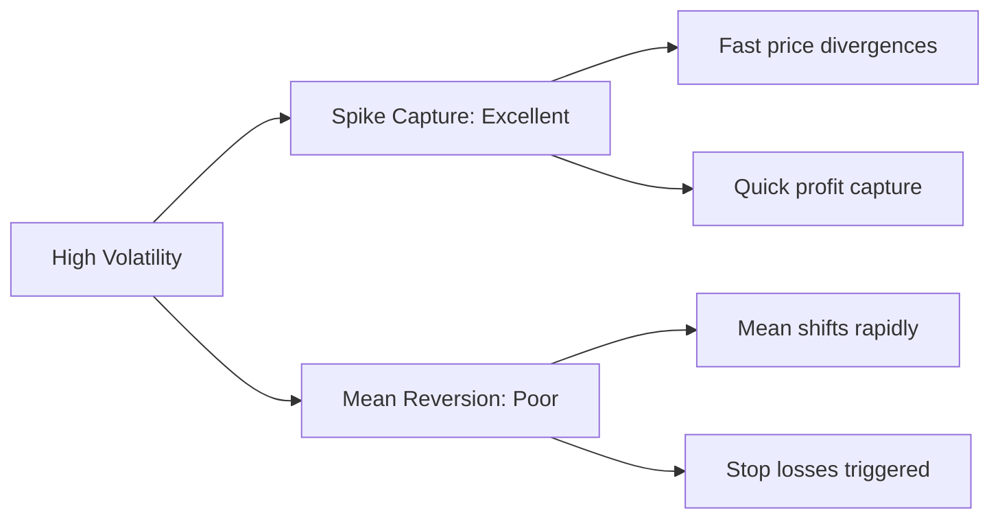
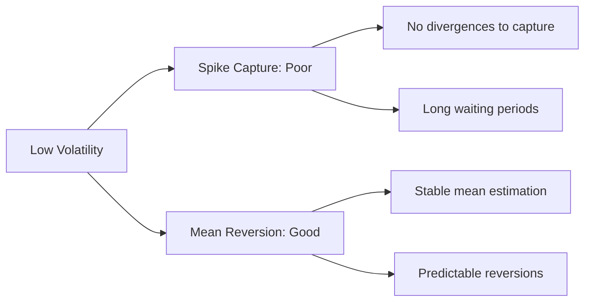
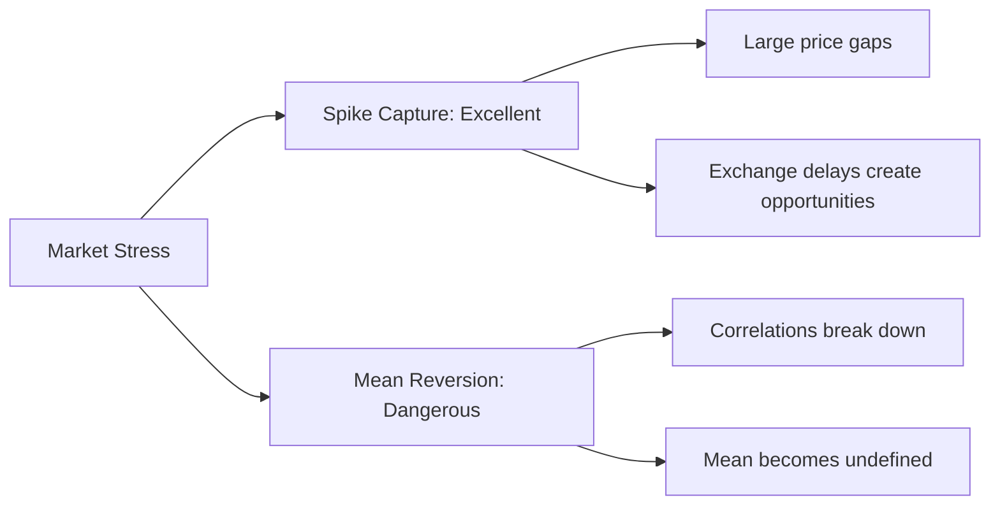

# Cross-Exchange Arbitrage Strategy Comparison

## Overview

This document provides a comprehensive comparison of the two primary arbitrage strategies implemented in the CEX arbitrage engine: **Optimized Spike Capture** and **Mean Reversion**. Both strategies target price inefficiencies between MEXC and Gate.io exchanges but use fundamentally different approaches.

## Quick Comparison Table

| Metric | Optimized Spike Capture | Mean Reversion |
|--------|------------------------|----------------|
| **Approach** | Momentum-based | Statistical arbitrage |
| **Holding Period** | 5-10 minutes | 9-120 minutes |
| **Entry Signal** | Price divergence spikes | Z-score threshold breach |
| **Technical Complexity** | Low (simple differential) | Medium (statistical indicators) |
| **Market Suitability** | High volatility periods | Ranging/stable markets |
| **Current BTC Performance** | 0 trades, 0.0% P&L | 184 trades, -25.1% P&L |
| **Risk Level** | Medium | High (longer exposure) |
| **Real-time Feasibility** | High | Medium (calculation lag) |

## Strategy-by-Strategy Analysis

### 1. Optimized Spike Capture Strategy

**📁 File**: `README_optimized_spike_capture_strategy.md`

**Core Logic**: Captures rapid price divergences between exchanges when one moves significantly more than the other.

**Key Strengths:**
- ✅ Fast execution (sub-second decisions)
- ✅ Short holding periods (reduced risk)
- ✅ Simple logic (easy to debug/optimize)
- ✅ Market neutral (profits from spreads)

**Key Weaknesses:**
- ❌ Requires high volatility to generate signals
- ❌ Sensitive to trading costs
- ❌ May miss trades in quiet markets

**Best Use Cases:**
- Market news events
- High-volatility altcoins
- Exchange latency arbitrage
- Maker fee rebate environments

---

### 2. Mean Reversion Strategy

**📁 File**: `README_mean_reversion_strategy.md`

**Core Logic**: Assumes extreme spread deviations will revert to historical mean using Z-score analysis.

**Key Strengths:**
- ✅ Statistical foundation
- ✅ Multiple exit conditions
- ✅ Works in ranging markets
- ✅ Correlation monitoring

**Key Weaknesses:**
- ❌ High transaction costs vs edge
- ❌ Vulnerable to regime changes
- ❌ Complex parameter optimization
- ❌ Poor performance on major pairs

**Best Use Cases:**
- Lower-volume altcoin pairs
- Longer timeframes (hourly/daily)
- Market stress periods
- Low-cost execution environments

## Performance Analysis

### Recent Test Results Summary

**Test Environment:**
- Symbol: BTC_USDT
- Data: Real order book snapshots
- Period: 6 hours (10,772 data points)
- Timeframe: 5-minute aggregation

#### Optimized Spike Capture
```
Trades: 0
Reason: No signals met minimum thresholds
Spread Range: -0.045% to 0.053%
Assessment: Market too quiet for momentum strategy
```

#### Mean Reversion  
```
Trades: 184
Win Rate: 0.0%
Total P&L: -25.132%
Average Loss: -0.137%
Assessment: Trading costs exceed statistical edge
```

### Key Insights

1. **BTC_USDT Challenges**: Major pairs have very tight spreads, making arbitrage difficult
2. **Cost Structure**: 0.14% round-trip costs require significant spread edges
3. **Market Efficiency**: Modern CEX markets are highly efficient, reducing opportunity size
4. **Timeframe Sensitivity**: 5-minute data may be too granular for these strategies

## Market Condition Suitability

### High Volatility Markets


### Low Volatility Markets


### Market Stress


## Optimization Recommendations

### For Current Market Conditions (Tight Spreads)

**Spike Capture Improvements:**
1. Lower minimum thresholds (0.10% → 0.05%)
2. Test on higher volatility pairs (altcoins)
3. Implement maker fee rebates
4. Use 1-minute timeframes for faster signals

**Mean Reversion Improvements:**
1. Increase Z-score thresholds (1.5 → 3.0+)
2. Use hourly timeframes instead of 5-minute
3. Focus on illiquid pairs with wider spreads
4. Implement position sizing based on signal strength

### Symbol Selection Guide

**Best for Spike Capture:**
- Newly listed tokens
- Low-liquidity pairs  
- High-beta altcoins
- During major news events

**Best for Mean Reversion:**
- Established altcoin pairs
- Medium liquidity tokens
- Stable correlation pairs
- Outside market hours

## Risk Management Comparison

### Risk Exposure Timeline

```mermaid
gantt
    title Strategy Risk Exposure Over Time
    dateFormat X
    axisFormat %M min
    
    section Spike Capture
    Position Entry     :0, 1
    Risk Window        :1, 10
    Forced Exit        :10, 11
    
    section Mean Reversion
    Position Entry     :0, 1
    Extended Risk      :1, 120
    Maximum Hold       :120, 121
```



### Risk Mitigation Features

| Risk Type | Spike Capture | Mean Reversion |
|-----------|---------------|----------------|
| **Time Risk** | 10-min max hold | 120-min max hold |
| **Directional Risk** | Stop loss 0.5% | Stop loss 0.5% |
| **Correlation Risk** | Not monitored | Correlation check |
| **Momentum Risk** | Momentum exit | Not monitored |
| **Execution Risk** | High (fast moves) | Medium (slower) |

## Technology Requirements

### Computational Complexity

**Spike Capture:**
```python
# Simple calculation per tick
differential = mexc_change - gateio_change
signal = abs(differential) > threshold
```

**Mean Reversion:**
```python  
# Rolling window calculations per tick
rolling_mean = spread.rolling(20).mean()
rolling_std = spread.rolling(20).std()
z_score = (current_spread - rolling_mean) / rolling_std
correlation = mexc.rolling(20).corr(gateio)
```

### Real-Time Requirements

| Requirement | Spike Capture | Mean Reversion |
|-------------|---------------|----------------|
| **Latency** | <100ms | <500ms |
| **Memory** | Minimal | 20+ periods buffer |
| **CPU** | Low | Medium (rolling stats) |
| **Data Feed** | Tick-by-tick | 5-min aggregated OK |

## Future Development Roadmap

### Phase 1: Immediate Improvements
1. **Parameter Optimization**: Systematic grid search for optimal settings
2. **Symbol Expansion**: Test on 20+ cryptocurrency pairs
3. **Timeframe Analysis**: Compare 1m, 5m, 15m, 1h performance
4. **Cost Optimization**: Implement maker rebate programs

### Phase 2: Enhanced Strategies  
1. **Hybrid Approach**: Combine momentum and mean reversion signals
2. **Machine Learning**: Train models on historical arbitrage success
3. **Multi-Exchange**: Expand beyond MEXC/Gate.io duopoly
4. **Dynamic Sizing**: Position size based on signal confidence

### Phase 3: Production Deployment
1. **Risk Controls**: Real-time monitoring and circuit breakers
2. **Portfolio Management**: Cross-strategy position limits
3. **Performance Attribution**: Track strategy-specific P&L
4. **Latency Optimization**: Co-location and direct market data

## Conclusion

Both strategies have merit but require significant adaptation for current market conditions:

**Optimized Spike Capture** shows promise for volatile market periods but needs parameter tuning and alternative symbols to generate signals.

**Mean Reversion** demonstrates the challenges of statistical arbitrage in efficient markets, where transaction costs often exceed statistical edges.

**Recommendation**: Focus development efforts on Spike Capture strategy with lower thresholds and higher volatility symbols, while using Mean Reversion as a complementary approach during specific market regimes.

The key to success lies not in choosing one strategy, but in understanding when each approach has positive expected value and deploying them accordingly.

---

*Strategy performance analysis based on real market data testing. Continued optimization and adaptation required for changing market conditions.*