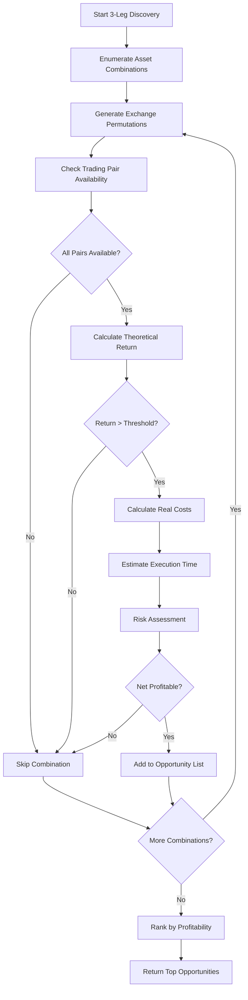
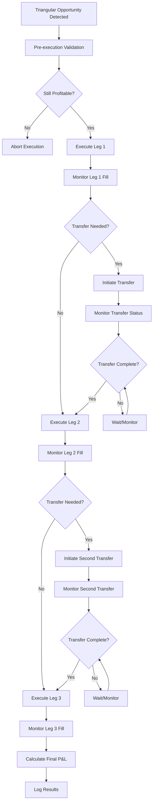
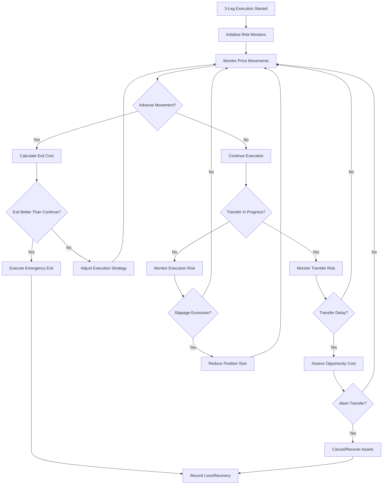

# Inventory Spot Strategy Refactoring Plan

## Executive Summary

This document outlines a comprehensive refactoring plan for the inventory spot arbitrage strategy, focusing on optimal spot-spot arbitrage candidate finding and execution. The current implementation at `inventory_spot_strategy_task.py` provides a solid foundation with MEXC-Gate.io spot arbitrage and futures hedging, but requires enhancement for systematic candidate discovery and optimized execution.

## Current Implementation Analysis

### Existing Architecture (`inventory_spot_strategy_task.py`)

**Strengths:**
- ✅ **Live Trading Ready**: Complete task implementation with position management
- ✅ **Delta Hedging**: Futures hedging for risk neutrality via `manage_delta_hedge()`
- ✅ **Multi-Exchange Support**: MEXC and Gate.io spot with Gate.io futures hedging
- ✅ **Signal Integration**: Uses `InventorySpotStrategySignal` for decision making
- ✅ **Order Management**: Sophisticated limit/market order combinations
- ✅ **Position Tracking**: Real-time inventory management across exchanges

**Current Signal Types (from `InventorySignalWithLimitEnum`):**
```python
# Market/Limit Order Combinations
MARKET_MEXC_SELL_LIMIT_GATEIO_BUY    # MEXC overpriced
LIMIT_MEXC_SELL_MARKET_GATEIO_BUY    # MEXC overpriced (aggressive Gate.io)
LIMIT_GATEIO_SELL_MARKET_MEXC_BUY    # Gate.io overpriced (aggressive MEXC)
MARKET_GATEIO_SELL_LIMIT_MEXC_BUY    # Gate.io overpriced
MARKET_GATEIO_SELL_MARKET_MEXC_BUY   # Immediate arbitrage
MARKET_MEXC_SELL_MARKET_GATEIO_BUY   # Immediate arbitrage
```

**Technical Capabilities:**
- **Real-time Book Ticker Processing**: Sub-50ms signal generation
- **Position Balance Validation**: Prevents overselling with inventory checks
- **Async Order Execution**: Parallel order placement for latency optimization
- **Delta Rebalancing**: Automatic futures position adjustment

### Gap Analysis

**Missing Components for Optimal Candidate Finding:**

1. **Systematic Symbol Discovery**: No automated process to identify profitable trading pairs
2. **Historical Performance Ranking**: Missing backtesting pipeline for candidate evaluation
3. **Transfer Cost Integration**: No implementation of cross-exchange transfer mechanics
4. **Multi-Timeframe Analysis**: Limited to real-time signals without historical context
5. **Risk-Adjusted Scoring**: No comprehensive scoring system for opportunity ranking

## Phase 1: Spot-Spot Arbitrage Candidate Finder

### 1.1 Enhanced Candidate Screening System

**Objective**: Create a systematic pipeline to identify and rank optimal spot-spot arbitrage opportunities.

#### 1.1.1 Symbol Universe Discovery

```python
class SpotArbitrageCandidateFinder:
    """Enhanced candidate discovery system for spot-spot arbitrage."""
    
    async def discover_common_symbols(self) -> Dict[Symbol, ExchangePairMetrics]:
        """Find all symbols tradeable on both MEXC and Gate.io spot."""
        
    async def calculate_historical_metrics(self, symbol: Symbol, days: int = 7) -> CandidateMetrics:
        """Calculate comprehensive arbitrage metrics for a symbol."""
        # Key metrics to calculate:
        # - Average spread (bid_mexc - ask_gateio, bid_gateio - ask_mexc)
        # - Spread volatility and frequency
        # - Volume-weighted opportunity size
        # - Price correlation and divergence patterns
        # - Liquidity depth analysis
```

#### 1.1.2 Advanced Scoring Algorithm

**Multi-Factor Scoring System:**

```python
@dataclass
class ArbitrageOpportunityScore:
    # Profitability Factors
    avg_spread_bps: float                    # Average arbitrage spread
    opportunity_frequency: float             # Opportunities per hour
    volume_weighted_spread: float            # Size-adjusted profitability
    
    # Risk Factors  
    price_correlation: float                 # Cross-exchange price correlation
    volatility_ratio: float                  # Relative price volatility
    liquidity_depth_score: float            # Market depth availability
    
    # Execution Factors
    avg_execution_time_ms: float             # Expected execution latency
    slippage_impact_bps: float              # Expected slippage cost
    transfer_viability_score: float         # Transfer feasibility (future)
    
    # Composite Score
    final_score: float                       # Weighted composite ranking
    
    def calculate_composite_score(self) -> float:
        """Calculate risk-adjusted opportunity score."""
        profitability = (self.avg_spread_bps * self.opportunity_frequency * 
                        self.volume_weighted_spread)
        
        risk_adjustment = (self.price_correlation * 
                          (1 - self.volatility_ratio) * 
                          self.liquidity_depth_score)
        
        execution_efficiency = (1 / (1 + self.avg_execution_time_ms/1000) * 
                               (1 - self.slippage_impact_bps/10000))
        
        return profitability * risk_adjustment * execution_efficiency
```

#### 1.1.3 Backtesting Integration

**Strategy Integration with Existing Infrastructure:**

```python
class SpotArbitrageBacktester:
    """Integrate with existing vectorized backtesting framework."""
    
    async def backtest_candidate(
        self, 
        symbol: Symbol, 
        strategy_params: Dict[str, Any],
        days: int = 30
    ) -> BacktestResult:
        """Run comprehensive backtest on spot arbitrage candidate."""
        
        # Use existing VectorizedStrategyBacktester
        backtester = VectorizedStrategyBacktester()
        
        # Configure for spot-spot arbitrage
        config = {
            'name': f'Spot Arbitrage - {symbol}',
            'type': 'inventory_spot_v2',  # Use enhanced V2 implementation
            'params': {
                'mexc_threshold_bps': strategy_params.get('entry_threshold', 30),
                'gateio_threshold_bps': strategy_params.get('exit_threshold', 5),
                'position_size_usd': strategy_params.get('position_size', 1000),
                'max_hold_time_minutes': strategy_params.get('max_hold', 60),
                'enable_transfers': False  # Phase 1: No transfers
            }
        }
        
        return await backtester.run_single_strategy_backtest(
            symbol=symbol,
            strategy_config=config,
            days=days
        )
```

### 1.2 Enhanced Signal Generation

#### 1.2.1 Multi-Timeframe Analysis

**Objective**: Enhance signal quality with historical context and trend analysis.

```python
class EnhancedSpotArbitrageSignal:
    """Enhanced signal generation with multi-timeframe analysis."""
    
    def __init__(self, lookback_minutes: int = 60):
        self.historical_spreads = deque(maxlen=lookback_minutes)
        self.trend_analyzer = SpreadTrendAnalyzer()
        
    async def generate_enhanced_signal(
        self, 
        mexc_book: BookTicker, 
        gateio_book: BookTicker
    ) -> EnhancedArbitrageSignal:
        """Generate signal with historical context."""
        
        # Current spread calculation
        mexc_to_gateio = (mexc_book.bid_price - gateio_book.ask_price) / gateio_book.ask_price
        gateio_to_mexc = (gateio_book.bid_price - mexc_book.ask_price) / mexc_book.ask_price
        
        # Historical context
        spread_percentile = self._calculate_spread_percentile(mexc_to_gateio)
        trend_strength = self.trend_analyzer.get_trend_strength()
        mean_reversion_signal = self._calculate_mean_reversion_probability()
        
        return EnhancedArbitrageSignal(
            primary_signal=self._get_base_signal(mexc_to_gateio, gateio_to_mexc),
            spread_percentile=spread_percentile,
            trend_strength=trend_strength,
            mean_reversion_probability=mean_reversion_signal,
            confidence_score=self._calculate_confidence()
        )
```

#### 1.2.2 Dynamic Threshold Optimization

**Objective**: Optimize entry/exit thresholds based on market conditions and historical performance.

```python
class DynamicThresholdOptimizer:
    """Optimize arbitrage thresholds based on market conditions."""
    
    async def optimize_thresholds(
        self, 
        symbol: Symbol, 
        lookback_days: int = 7
    ) -> OptimalThresholds:
        """Calculate optimal entry/exit thresholds."""
        
        # Analyze historical performance
        historical_data = await self.get_historical_spreads(symbol, lookback_days)
        
        # Calculate optimal thresholds
        entry_threshold = self._calculate_optimal_entry(historical_data)
        exit_threshold = self._calculate_optimal_exit(historical_data)
        
        # Risk-adjusted sizing
        position_size = self._calculate_optimal_position_size(
            historical_data, 
            volatility=historical_data.spread_std
        )
        
        return OptimalThresholds(
            entry_threshold_bps=entry_threshold,
            exit_threshold_bps=exit_threshold,
            position_size_usd=position_size,
            confidence_interval=self._calculate_confidence_interval()
        )
```

### 1.3 Implementation Workflow

**Phase 1 Implementation Steps:**

1. **Week 1-2**: Symbol Discovery and Metrics Calculation
   - Implement `SpotArbitrageCandidateFinder`
   - Create historical data collection pipeline
   - Develop multi-factor scoring system

2. **Week 3-4**: Backtesting Integration
   - Integrate with existing `VectorizedStrategyBacktester`
   - Implement `SpotArbitrageBacktester`
   - Create performance ranking system

3. **Week 5-6**: Enhanced Signal Generation
   - Develop `EnhancedSpotArbitrageSignal`
   - Implement `DynamicThresholdOptimizer`
   - Create real-time candidate monitoring

4. **Week 7-8**: Testing and Validation
   - Comprehensive backtesting on historical data
   - Performance comparison with current implementation
   - Risk validation and stress testing

## Phase 2: Transfer Integration (Future Enhancement)

### 2.1 Cross-Exchange Transfer System

**Objective**: Enable asset transfers between exchanges for enhanced arbitrage opportunities.

#### 2.1.1 Transfer Cost Modeling

```python
@dataclass
class TransferCost:
    """Model cross-exchange transfer costs and timing."""
    
    # Cost Components
    withdrawal_fee_fixed: float              # Fixed withdrawal fee
    withdrawal_fee_percentage: float         # Percentage-based fee
    deposit_fee: float                       # Deposit fee (usually 0)
    network_fee: float                       # Blockchain network fee
    
    # Timing Components
    confirmation_time_minutes: int          # Network confirmation time
    exchange_processing_minutes: int        # Exchange internal processing
    total_transfer_time_minutes: int        # Total transfer duration
    
    # Risk Components
    failure_probability: float              # Transfer failure risk
    slippage_during_transfer_bps: float     # Price movement risk

class TransferArbitrageStrategy:
    """Enhanced arbitrage with transfer capabilities."""
    
    async def evaluate_transfer_opportunity(
        self, 
        symbol: Symbol,
        source_exchange: ExchangeEnum,
        target_exchange: ExchangeEnum
    ) -> TransferOpportunityEvaluation:
        """Evaluate if transfer-based arbitrage is profitable."""
        
        # Get current spreads
        current_spread = await self.get_cross_exchange_spread(symbol)
        
        # Calculate transfer costs
        transfer_cost = await self.get_transfer_cost(symbol, source_exchange, target_exchange)
        
        # Model expected spread after transfer time
        expected_spread_after_transfer = await self.model_future_spread(
            symbol, 
            minutes_ahead=transfer_cost.total_transfer_time_minutes
        )
        
        # Risk-adjusted profitability
        net_profitability = (expected_spread_after_transfer - 
                            transfer_cost.total_cost_bps - 
                            transfer_cost.slippage_during_transfer_bps)
        
        return TransferOpportunityEvaluation(
            net_profitability_bps=net_profitability,
            transfer_time_minutes=transfer_cost.total_transfer_time_minutes,
            risk_score=transfer_cost.failure_probability,
            recommended_action=self._determine_action(net_profitability)
        )
```

#### 2.1.2 Transfer Execution Workflow

```python
class TransferExecutionManager:
    """Manage cross-exchange transfer execution."""
    
    async def execute_transfer_arbitrage(
        self,
        opportunity: TransferOpportunityEvaluation,
        symbol: Symbol,
        quantity: float
    ) -> TransferArbitrageResult:
        """Execute complete transfer-based arbitrage cycle."""
        
        # Phase 1: Initial position
        initial_trade = await self.execute_initial_trade(
            exchange=opportunity.source_exchange,
            symbol=symbol,
            side=opportunity.initial_side,
            quantity=quantity
        )
        
        # Phase 2: Transfer initiation
        transfer_result = await self.initiate_transfer(
            symbol=symbol,
            quantity=quantity,
            from_exchange=opportunity.source_exchange,
            to_exchange=opportunity.target_exchange
        )
        
        # Phase 3: Monitor transfer
        transfer_status = await self.monitor_transfer(transfer_result.transfer_id)
        
        # Phase 4: Final arbitrage trade
        if transfer_status.completed:
            final_trade = await self.execute_final_trade(
                exchange=opportunity.target_exchange,
                symbol=symbol,
                side=opportunity.final_side,
                quantity=quantity
            )
            
            return TransferArbitrageResult(
                initial_trade=initial_trade,
                transfer_result=transfer_result,
                final_trade=final_trade,
                total_pnl=self.calculate_total_pnl(initial_trade, final_trade, transfer_result),
                execution_time_minutes=transfer_status.total_time_minutes
            )
```

## Phase 3: 3-Leg Arbitrage (Advanced Future Enhancement)

### 3.1 3-Leg Arbitrage Overview

**Concept**: Triangular arbitrage opportunities across three trading pairs on multiple exchanges, enabling profit from price discrepancies in currency triangles.

**Example Triangular Arbitrage:**
```
BTC/USDT (Exchange A) → ETH/BTC (Exchange B) → ETH/USDT (Exchange C) → Return to USDT
```

**Enhanced Multi-Exchange Triangular:**
```
MEXC: BTC/USDT → Gate.io: ETH/BTC → Binance: ETH/USDT → Transfer back to MEXC
```

### 3.2 3-Leg Arbitrage Architecture

#### 3.2.1 Triangular Opportunity Detection

```python
@dataclass
class TriangularPath:
    """Define a triangular arbitrage path across exchanges."""
    
    # Path Definition
    base_asset: str                          # Starting asset (e.g., "USDT")
    intermediate_asset: str                  # Middle asset (e.g., "BTC")  
    target_asset: str                        # Final asset (e.g., "ETH")
    
    # Exchange Mapping
    leg1_exchange: ExchangeEnum              # base → intermediate
    leg2_exchange: ExchangeEnum              # intermediate → target  
    leg3_exchange: ExchangeEnum              # target → base
    
    # Trading Pairs
    leg1_pair: str                           # "BTC/USDT"
    leg2_pair: str                           # "ETH/BTC" 
    leg3_pair: str                           # "ETH/USDT"
    
    # Expected Returns
    theoretical_return_bps: float            # Before costs
    net_return_bps: float                    # After all costs
    execution_time_estimate_minutes: int     # Total execution time

class TriangularArbitrageFinder:
    """Detect triangular arbitrage opportunities across exchanges."""
    
    def __init__(self):
        self.supported_exchanges = [ExchangeEnum.MEXC, ExchangeEnum.GATEIO, ExchangeEnum.BINANCE]
        self.major_assets = ["BTC", "ETH", "BNB", "ADA", "SOL", "AVAX"]
        self.base_currencies = ["USDT", "USDC", "BUSD"]
        
    async def discover_triangular_paths(self) -> List[TriangularPath]:
        """Discover all viable triangular arbitrage paths."""
        
        viable_paths = []
        
        for base_asset in self.base_currencies:
            for intermediate in self.major_assets:
                for target in self.major_assets:
                    if intermediate == target:
                        continue
                        
                    # Check all exchange combinations
                    for leg1_exchange in self.supported_exchanges:
                        for leg2_exchange in self.supported_exchanges:
                            for leg3_exchange in self.supported_exchanges:
                                
                                path = await self.evaluate_triangular_path(
                                    base_asset=base_asset,
                                    intermediate_asset=intermediate,
                                    target_asset=target,
                                    leg1_exchange=leg1_exchange,
                                    leg2_exchange=leg2_exchange,
                                    leg3_exchange=leg3_exchange
                                )
                                
                                if path and path.net_return_bps > 50:  # Minimum 0.5% return
                                    viable_paths.append(path)
        
        return sorted(viable_paths, key=lambda x: x.net_return_bps, reverse=True)
```

#### 3.2.2 3-Leg Execution Engine

```python
class TriangularArbitrageExecutor:
    """Execute triangular arbitrage with risk management."""
    
    async def execute_triangular_arbitrage(
        self, 
        path: TriangularPath,
        capital_usdt: float
    ) -> TriangularArbitrageResult:
        """Execute complete triangular arbitrage cycle."""
        
        execution_plan = await self.create_execution_plan(path, capital_usdt)
        
        # Phase 1: Leg 1 Execution
        leg1_result = await self.execute_leg(
            exchange=path.leg1_exchange,
            pair=path.leg1_pair,
            side="BUY" if path.base_asset == "USDT" else "SELL",
            amount=execution_plan.leg1_amount,
            execution_strategy="AGGRESSIVE"  # Speed priority
        )
        
        # Phase 2: Asset Transfer (if needed)
        if path.leg1_exchange != path.leg2_exchange:
            transfer_result = await self.transfer_asset(
                asset=path.intermediate_asset,
                amount=leg1_result.received_amount,
                from_exchange=path.leg1_exchange,
                to_exchange=path.leg2_exchange
            )
            leg2_available = transfer_result.amount_received
        else:
            leg2_available = leg1_result.received_amount
        
        # Phase 3: Leg 2 Execution  
        leg2_result = await self.execute_leg(
            exchange=path.leg2_exchange,
            pair=path.leg2_pair,
            side=self.determine_leg2_side(path),
            amount=leg2_available,
            execution_strategy="BALANCED"
        )
        
        # Phase 4: Second Transfer (if needed)
        if path.leg2_exchange != path.leg3_exchange:
            transfer_result2 = await self.transfer_asset(
                asset=path.target_asset,
                amount=leg2_result.received_amount,
                from_exchange=path.leg2_exchange,
                to_exchange=path.leg3_exchange
            )
            leg3_available = transfer_result2.amount_received
        else:
            leg3_available = leg2_result.received_amount
            
        # Phase 5: Leg 3 Execution (Close the triangle)
        leg3_result = await self.execute_leg(
            exchange=path.leg3_exchange,
            pair=path.leg3_pair,
            side=self.determine_leg3_side(path),
            amount=leg3_available,
            execution_strategy="CONSERVATIVE"  # Profit preservation
        )
        
        return TriangularArbitrageResult(
            initial_capital=capital_usdt,
            final_amount=leg3_result.received_amount,
            total_pnl=leg3_result.received_amount - capital_usdt,
            total_return_pct=(leg3_result.received_amount - capital_usdt) / capital_usdt * 100,
            execution_time_minutes=self.calculate_total_execution_time(),
            path_executed=path,
            leg_results=[leg1_result, leg2_result, leg3_result]
        )
```

### 3.3 3-Leg Arbitrage Workflow Diagrams

#### 3.3.1 Opportunity Discovery Workflow



#### 3.3.2 Execution Workflow



#### 3.3.3 Risk Management Workflow



### 3.4 Risk Considerations for 3-Leg Arbitrage

#### 3.4.1 Execution Risks

1. **Price Movement Risk**: Prices can move against the arbitrage during execution
2. **Transfer Risk**: Asset transfers between exchanges create timing exposure
3. **Liquidity Risk**: Insufficient liquidity on any leg can cause slippage
4. **Technical Risk**: Exchange downtime or API failures during execution
5. **Regulatory Risk**: Different regulatory environments across exchanges

#### 3.4.2 Risk Mitigation Strategies

```python
class TriangularRiskManager:
    """Comprehensive risk management for 3-leg arbitrage."""
    
    async def pre_execution_validation(self, path: TriangularPath) -> bool:
        """Validate opportunity before execution."""
        
        # Check liquidity depth
        sufficient_liquidity = await self.validate_liquidity_depth(path)
        
        # Check exchange connectivity
        exchanges_healthy = await self.validate_exchange_health(path)
        
        # Check transfer feasibility
        transfers_viable = await self.validate_transfer_routes(path)
        
        # Check regulatory compliance
        regulatory_clear = await self.validate_regulatory_compliance(path)
        
        return all([sufficient_liquidity, exchanges_healthy, transfers_viable, regulatory_clear])
    
    async def monitor_execution_risk(self, execution_state: TriangularExecutionState):
        """Real-time risk monitoring during execution."""
        
        # Price movement monitoring
        price_divergence = await self.calculate_price_divergence(execution_state)
        
        if price_divergence > self.max_acceptable_divergence:
            await self.trigger_emergency_exit(execution_state)
            
        # Transfer delay monitoring  
        if execution_state.transfer_in_progress:
            transfer_delay = await self.calculate_transfer_delay(execution_state)
            
            if transfer_delay > self.max_acceptable_delay:
                await self.assess_abort_transfer(execution_state)
```

## Implementation Priorities

### Phase 1 (Immediate - Next 2 Months)
1. ✅ **Spot-Spot Arbitrage Optimization**
   - Enhanced candidate finder with multi-factor scoring
   - Integration with existing backtesting infrastructure
   - Dynamic threshold optimization
   - Real-time performance monitoring

### Phase 2 (Medium-term - 3-6 Months) 
2. 🔄 **Transfer Integration**
   - Cross-exchange transfer cost modeling
   - Transfer execution management
   - Risk assessment for transfer-based arbitrage
   - Integration with existing position management

### Phase 3 (Long-term - 6-12 Months)
3. 🚀 **3-Leg Arbitrage Implementation**
   - Triangular opportunity detection system
   - Multi-exchange execution engine
   - Comprehensive risk management
   - Advanced analytics and reporting

## Success Metrics

### Phase 1 KPIs
- **Candidate Discovery**: Identify 50+ viable spot arbitrage pairs
- **Backtest Performance**: >15% annual return with <10% max drawdown
- **Signal Quality**: >60% win rate with 2:1 reward:risk ratio
- **Execution Speed**: <500ms signal-to-order latency

### Phase 2 KPIs  
- **Transfer Efficiency**: <5% of opportunities requiring transfers
- **Transfer Success Rate**: >95% successful transfer completion
- **Enhanced Returns**: 20% improvement in opportunity capture

### Phase 3 KPIs
- **3-Leg Opportunities**: Identify 10+ viable triangular paths daily
- **Execution Success**: >80% successful 3-leg completion rate
- **Risk Management**: <2% of capital at risk per 3-leg execution
- **Return Enhancement**: 30% improvement in risk-adjusted returns

## Conclusion

This refactoring plan provides a comprehensive roadmap for transforming the inventory spot arbitrage strategy from a single-pair implementation to a systematic, multi-asset arbitrage system. The phased approach ensures immediate value delivery while building toward advanced capabilities like cross-exchange transfers and triangular arbitrage.

The existing `inventory_spot_strategy_task.py` provides a solid foundation with proven live trading capabilities, position management, and risk controls. By enhancing it with systematic candidate discovery, advanced signal generation, and comprehensive backtesting, we can significantly improve profitability while maintaining the robust risk management already in place.

The future phases for transfer integration and 3-leg arbitrage represent significant opportunities for alpha generation, leveraging the strong foundation built in Phase 1 to capture more complex arbitrage opportunities across the cryptocurrency ecosystem.