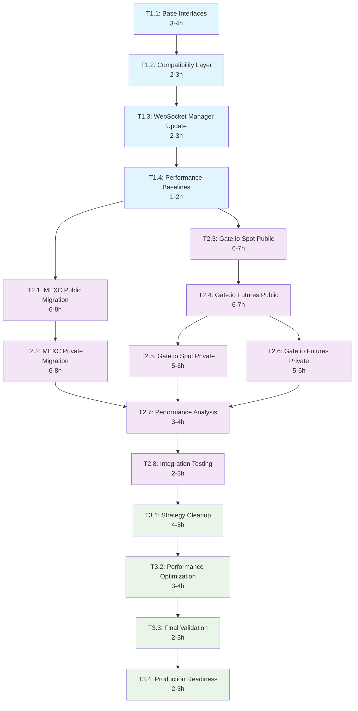

# WebSocket Refactoring - Task Dependencies & Timeline

## Project Summary

**Total Duration**: 53-72 hours (6.5-9 weeks)
**Risk Level**: Medium (mitigated by phased approach)
**Expected Performance Gain**: 25-35μs latency reduction per message

## Complete Task Dependency Graph



## Phase-by-Phase Timeline

### Phase 1: Infrastructure Foundation (8-12 hours)
**Week 1-2 | Risk: Low | Can start immediately**

| Task | Duration | Dependencies | Risk | Notes |
|------|----------|--------------|------|-------|
| T1.1: Base Interfaces | 3-4h | None | Low | Pure abstraction, no functional impact |
| T1.2: Compatibility Layer | 2-3h | T1.1 | Low | Enables dual-path operation |
| T1.3: WebSocket Manager Update | 2-3h | T1.2 | Medium | Core infrastructure change |
| T1.4: Performance Baselines | 1-2h | T1.3 | Low | Metrics collection only |

**Phase 1 Deliverables**:
- ✅ New architecture interfaces ready
- ✅ Dual-path operation enabled (old + new)
- ✅ Performance baseline established
- ✅ Zero risk rollback capability

---

### Phase 2: Exchange Migration (35-45 hours)
**Week 2-7 | Risk: Medium | Requires Phase 1 completion**

#### MEXC Migration (12-16 hours)
| Task | Duration | Dependencies | Risk | Priority |
|------|----------|--------------|------|----------|
| T2.1: MEXC Public Migration | 6-8h | T1.4 | Medium | High (protobuf optimization) |
| T2.2: MEXC Private Migration | 6-8h | T2.1 | Medium | High (validate pattern) |

#### Gate.io Migration (20-26 hours)
| Task | Duration | Dependencies | Risk | Priority |
|------|----------|--------------|------|----------|
| T2.3: Gate.io Spot Public | 6-7h | T1.4 | Medium | Medium |
| T2.4: Gate.io Futures Public | 6-7h | T2.3 | Medium | Medium |
| T2.5: Gate.io Spot Private | 5-6h | T2.3 | Medium | Low |
| T2.6: Gate.io Futures Private | 5-6h | T2.4 | Medium | Low |

#### Validation & Testing (5-7 hours)
| Task | Duration | Dependencies | Risk | Priority |
|------|----------|--------------|------|----------|
| T2.7: Performance Analysis | 3-4h | All migrations | Low | High |
| T2.8: Integration Testing | 2-3h | T2.7 | Low | High |

**Phase 2 Deliverables**:
- ✅ All exchanges migrated to direct message handling
- ✅ 15-25μs latency improvement achieved
- ✅ Backward compatibility maintained
- ✅ Performance gains validated

---

### Phase 3: Cleanup & Optimization (11-15 hours)
**Week 7-9 | Risk: Low | Requires Phase 2 completion**

| Task | Duration | Dependencies | Risk | Priority |
|------|----------|--------------|------|----------|
| T3.1: Strategy Cleanup | 4-5h | T2.8 | Low | High |
| T3.2: Performance Optimization | 3-4h | T3.1 | Low | Medium |
| T3.3: Final Validation | 2-3h | T3.2 | Low | High |
| T3.4: Production Readiness | 2-3h | T3.3 | Low | High |

**Phase 3 Deliverables**:
- ✅ Legacy code completely removed
- ✅ Additional 5-10μs performance improvement
- ✅ Production deployment ready
- ✅ Comprehensive documentation complete

---

## Critical Path Analysis

### Longest Dependency Chain (31-40 hours)
```
T1.1 → T1.2 → T1.3 → T1.4 → T2.1 → T2.2 → T2.7 → T2.8 → T3.1 → T3.2 → T3.3 → T3.4
3-4h   2-3h   2-3h   1-2h   6-8h   6-8h   3-4h   2-3h   4-5h   3-4h   2-3h   2-3h
```

### Parallelization Opportunities

**Phase 1**: Sequential execution required (dependencies)
**Phase 2**: Parallel paths available:
- MEXC migration (T2.1 → T2.2) can run parallel to Gate.io Spot (T2.3)
- Gate.io Spot Private (T2.5) and Futures Private (T2.6) can run in parallel after T2.4

**Phase 3**: Sequential execution recommended (cleanup dependencies)

### Time Optimization Strategies

1. **Parallel Development**: Run MEXC and Gate.io migrations concurrently where possible
2. **Incremental Validation**: Test each component immediately after implementation
3. **Early Performance Testing**: Start performance validation during Phase 2
4. **Documentation Parallel Track**: Write documentation during implementation

## Risk Management Timeline

### Week 1-2: Foundation (Low Risk)
**Mitigation**: Comprehensive testing, no functional changes
**Rollback**: Immediate (compatibility layer)

### Week 3-5: MEXC Migration (Medium Risk)
**Mitigation**: Start with public (less critical), validate before private
**Rollback**: Per-exchange configuration flags

### Week 6-7: Gate.io Migration (Medium Risk)
**Mitigation**: Leverage proven MEXC patterns, spot before futures
**Rollback**: Individual handler rollback capability

### Week 8-9: Cleanup (Low Risk)
**Mitigation**: Keep legacy code in version control
**Rollback**: Git revert + configuration change

## Resource Allocation

### Development Team Requirements
- **Senior Developer**: Architecture design and critical path tasks
- **Mid-Level Developer**: Implementation and testing tasks
- **QA Engineer**: Performance testing and validation

### Infrastructure Requirements
- **Staging Environment**: Full production-like testing
- **Performance Testing**: Isolated environment for benchmarking
- **Monitoring**: Enhanced metrics collection during migration

## Success Milestones

### Week 2: Phase 1 Complete
- [ ] Dual-path architecture operational
- [ ] Performance baselines established
- [ ] Team trained on new patterns

### Week 5: MEXC Migration Complete
- [ ] MEXC showing 20-30μs improvement
- [ ] Pattern validated for other exchanges
- [ ] Rollback procedures tested

### Week 7: All Migrations Complete
- [ ] All exchanges on new architecture
- [ ] Performance targets achieved
- [ ] System stability confirmed

### Week 9: Project Complete
- [ ] Legacy code removed
- [ ] Production deployment ready
- [ ] Documentation complete

## Contingency Planning

### High-Risk Scenarios

1. **Performance Regression Detected**
   - **Response**: Immediate rollback to previous architecture
   - **Investigation**: 24-48 hour analysis period
   - **Resolution**: Fix issue or adjust performance targets

2. **Critical Functionality Broken**
   - **Response**: Per-exchange rollback via configuration
   - **Investigation**: Immediate debugging and fix
   - **Resolution**: Patch deployment within 4 hours

3. **Timeline Delays**
   - **Response**: Prioritize critical path, defer optimization
   - **Adjustment**: Extend timeline or reduce scope
   - **Communication**: Update stakeholders within 24 hours

### Recovery Procedures

- **Immediate Rollback**: Configuration flag changes (< 5 minutes)
- **Selective Rollback**: Per-exchange revert capability
- **Emergency Hotfix**: Critical bug fix deployment process
- **Communication Plan**: Incident response and status updates

---

**Next Steps**: Begin Phase 1 implementation with T1.1 (Base Interfaces)