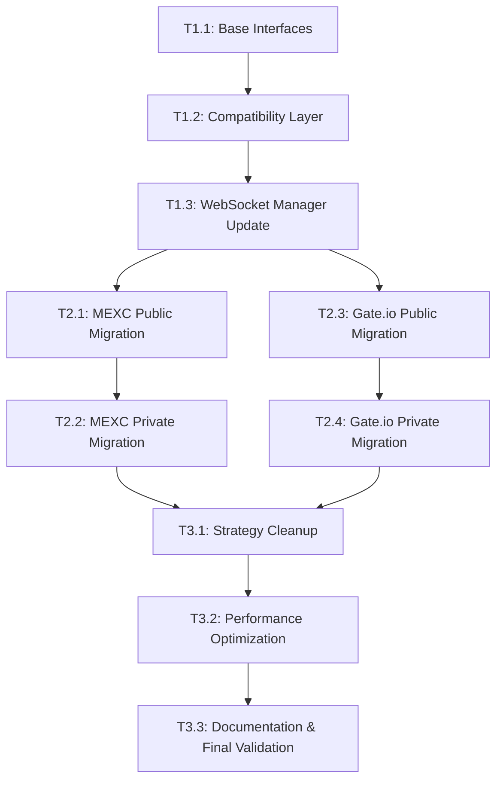

# WebSocket Infrastructure Refactoring - Master Plan

## Project Overview

**Objective**: Refactor WebSocket infrastructure to eliminate strategy pattern for message parsing, implementing direct `_handle_message()` handlers per exchange for optimal HFT performance.

**Timeline**: 45-65 hours across 3 phases (6-8 weeks)
**Risk Level**: Medium (mitigated by phased approach and compatibility layer)
**Expected Performance Gain**: 10-20μs reduction per message, 73% reduction in function call overhead

## Strategic Architecture Changes

### Current Architecture (Strategy Pattern)
```
WebSocket Manager → WebSocketStrategySet → MessageParser → Handler
(4 hops, 130ns overhead + parsing time)
```

### Target Architecture (Direct Dispatch)
```
WebSocket Manager → Exchange._handle_message() → Handler  
(2 hops, 35ns overhead + parsing time)
```

### Key Design Decisions

1. **Template Method Pattern**: Replace strategy pattern with inheritance-based direct handling
2. **Exchange-Specific Optimization**: Each exchange handles its own protocol directly (JSON/protobuf)
3. **Public/Private Separation**: Separate WebSocket handlers for public vs private operations
4. **Compatibility Layer**: Dual-path support during migration for zero-downtime transition

## Phase Structure

### Phase 1: Infrastructure Foundation (Low Risk, 7-12 hours)
- Establish new interfaces and base classes
- Create compatibility layer for dual-path operation
- Update WebSocket Manager to support both architectures

### Phase 2: Exchange Migration (Medium Risk, 28-38 hours)
- Migrate each exchange to direct message handling
- Implement exchange-specific optimizations
- Comprehensive testing and validation

### Phase 3: Cleanup & Optimization (Low Risk, 11-15 hours)
- Remove legacy strategy pattern code
- Performance optimization and documentation
- Final validation and monitoring setup

## Risk Management & Mitigation

### High-Risk Areas
1. **WebSocket Manager Changes**: Core infrastructure component
2. **Message Parsing Migration**: Critical data processing logic
3. **Public/Private Handler Separation**: Complex state management

### Mitigation Strategies
1. **Compatibility Layer**: Allows instant rollback to old architecture
2. **Incremental Testing**: Each component validated independently
3. **Performance Monitoring**: Real-time metrics to detect regressions
4. **Exchange-by-Exchange Migration**: Isolate changes to minimize blast radius

### Rollback Plan
- Keep strategy pattern code until full migration validated
- Feature flags to switch between old/new architecture per exchange
- Automated performance regression detection triggers rollback

## Success Criteria

### Performance Metrics
- **Latency**: <100μs message processing (current requirement maintained)
- **Throughput**: No degradation in messages/second capacity
- **Memory**: Reduced allocation overhead from simplified call stack
- **CPU**: Improved cache efficiency from sequential execution

### Functional Requirements
- **Zero Data Loss**: All message types continue to be processed correctly
- **Error Handling**: Maintain current error recovery and logging capabilities
- **Monitoring**: All existing metrics and alerts continue to function
- **Backward Compatibility**: External interfaces remain unchanged

## Detailed Task Dependencies



## Implementation Guidelines

### Exchange-Specific Considerations

**MEXC**:
- Leverage existing protobuf optimization work
- Maintain zero-allocation parsing for high-frequency messages
- Special handling for binary vs JSON message detection

**Gate.io**:
- Handle spot vs futures WebSocket differences
- Optimize for JSON parsing performance
- Maintain compatibility with existing symbol extraction logic

### Interface Design Principles

1. **Minimal Viable Interface**: Only essential methods in base class
2. **Exchange Freedom**: Implementations can optimize internal structure
3. **Error Boundary**: Clear exception handling contracts
4. **Performance First**: Design optimized for sub-100μs processing

### Testing Strategy

1. **Unit Testing**: Each `_handle_message()` implementation thoroughly tested
2. **Integration Testing**: End-to-end message flow validation
3. **Performance Testing**: Latency and throughput benchmarks
4. **Load Testing**: High-volume message processing validation
5. **Error Testing**: Connection failures and malformed message handling

## Monitoring & Validation

### Performance Baselines
- Establish current latency/throughput metrics before migration
- Create automated performance regression tests
- Set up real-time monitoring dashboards

### Migration Checkpoints
- Each task has specific success criteria and validation steps
- Performance metrics must meet or exceed baseline before proceeding
- Functional testing covers all message types and error scenarios

### Post-Migration Monitoring
- Extended observation period after each exchange migration
- Automated alerts for performance degradation
- Regular architecture reviews and optimization opportunities

---

**Next Step**: Review detailed task breakdown in individual task files for implementation specifics.